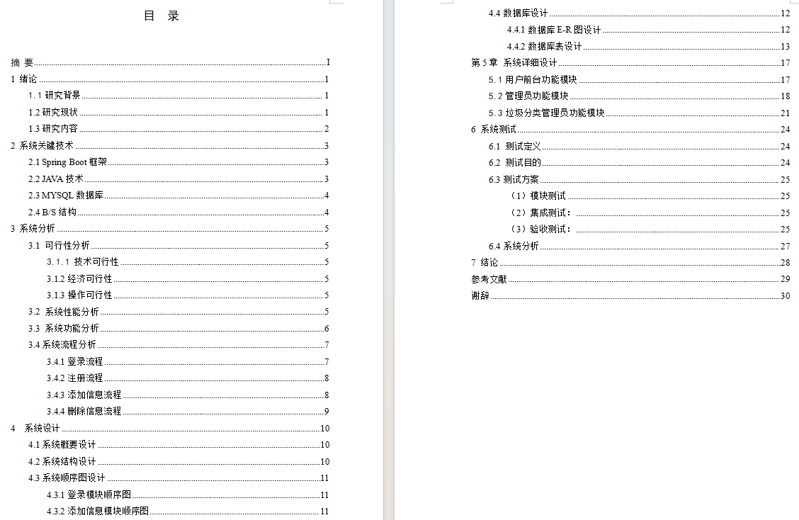
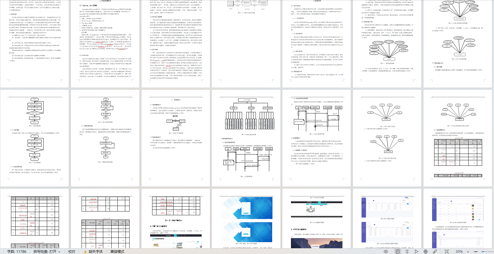
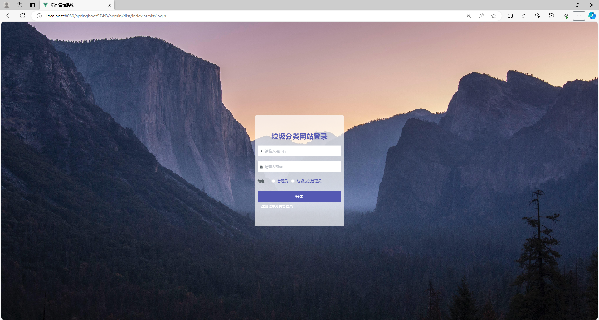
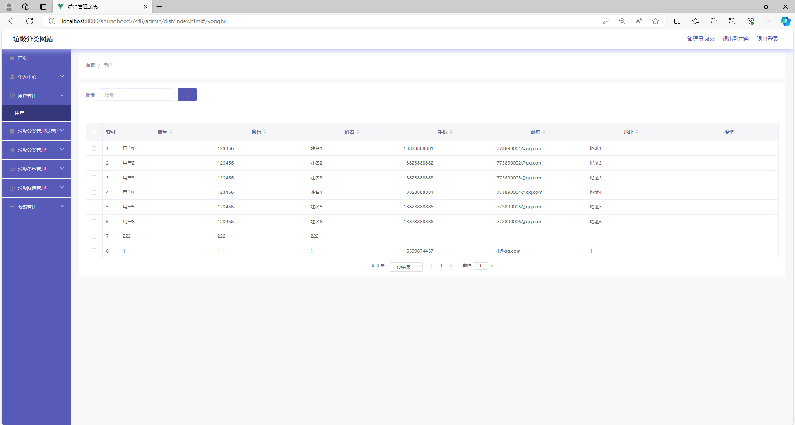
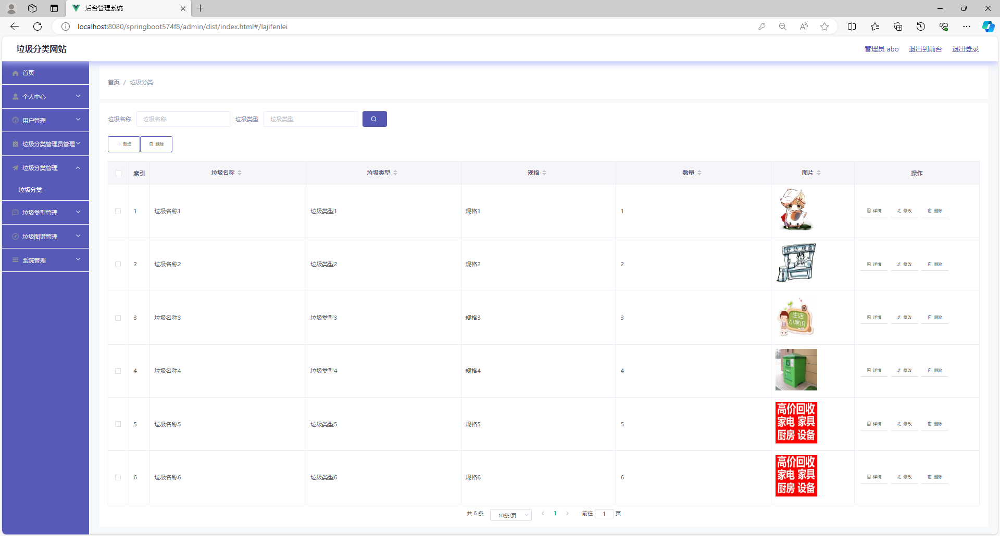
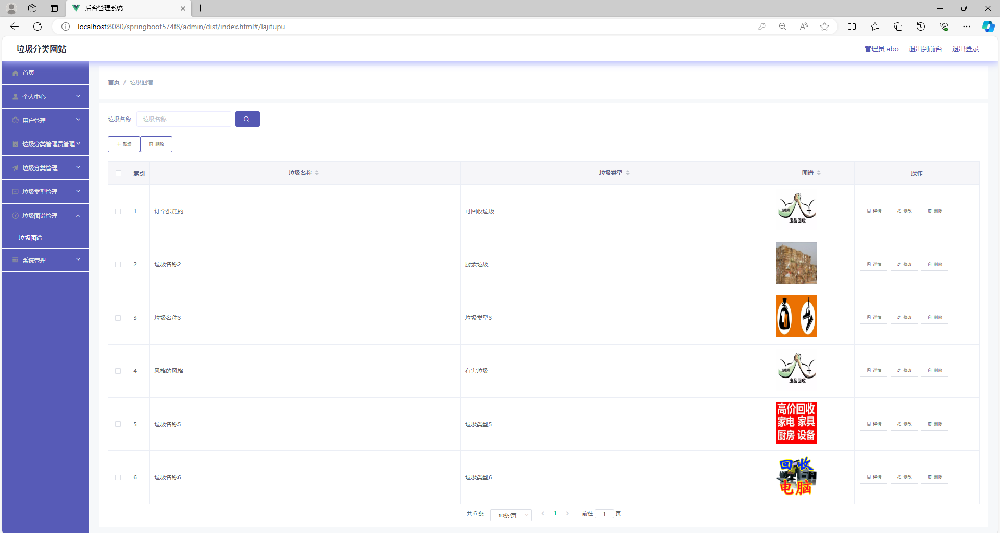
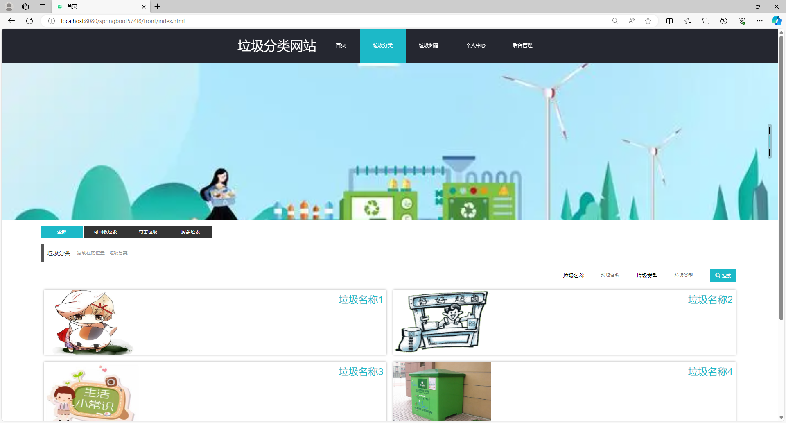
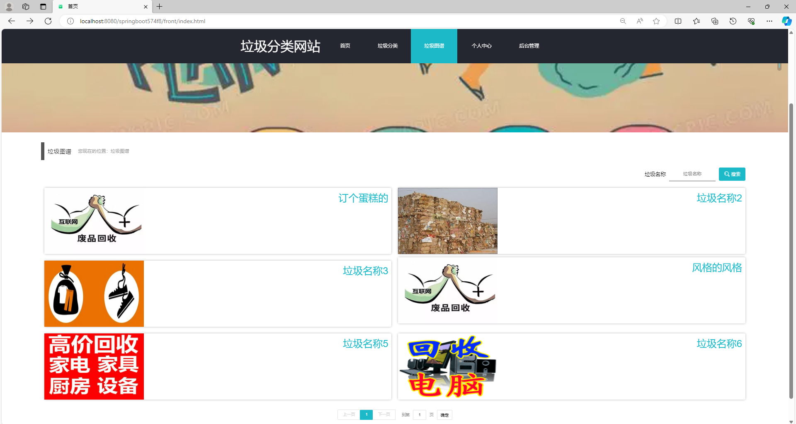

# 垃圾分类系统

### 9.9￥ 获取完整源码+sql，附赠11000字论文参考，需要加Q：3808981644  或者加微信 ：qszard26
### 有问题，或者需要协助调试运行项目的也可联系
### 更多项目： https://github.com/34426?tab=repositories

## 一、项目介绍

开发语言：java

运行环境:idea或eclipse 数据库:mysql

技术栈：springboot、mybatisplus、vue、html

垃圾分类系统的主要使用者分为管理员和用户、垃圾分类管理员，

实现功能包括管理员：首页、个人中心、用户管理、垃圾分类管理员管理、垃圾分类管理、垃圾类型管理、垃圾图谱管理、系统管理

垃圾分类管理员；首页、个人中心、用户管理、垃圾分类管理员管理、垃圾分类管理、垃圾类型管理、垃圾图谱管理

用户前台；首页、垃圾分类、垃圾图谱、个人中心、后台管理等功能。由于本网站的功能模块设计比较全面，所以使得整个垃圾分类网站信息管理的过程得以实现。

## 二、11000字论文参考

## 三、部分功能界面展示

### 9.9￥ 获取完整源码+sql，附赠11000字论文参考，需要加Q：3808981644  或者加微信 ：qszard26
### 有问题，或者需要协助调试运行项目的也可联系

